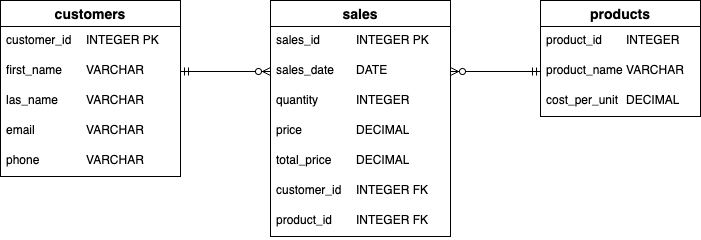

# Reports

This is a small project where you need to design/create a SQL-DB with data. From this DB are a sells report created.

Note, the focus on this project is not on the database design. It is only an addition to make the **data analysis**. There could be magnitude of ways to make the database more complex and then needed for normalization.

## Information

## Tables
Defined tables:
- sales
- customer
- products

### table attributes
**sales:**
- sales_id INTEGER
- sales_data DATE
- quantity INTEGER
- price DECIMAL
- total_price DECIMAL
- customer_id INTEGER
- product_id INTEGER

**customers:**
- customer_id INTEGER
- first_name VARCHAR
- last_name VARCHAR
- email VARCAHR
- phone VARCHAR

**products:**
- product_id INTEGER
- product_name VARCHAR
- cost_per_unit DECIMAL